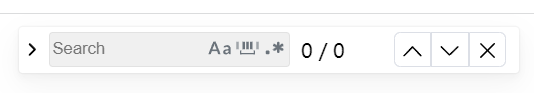

# search-bar-vue3

**Vue2 version**：[WenyaoL/search-bar-vue2: Recurrence of browser ctrl+F function (github.com)](https://github.com/WenyaoL/search-bar-vue2)

## Install

```shell
npm install search-bar-vue3 --save
```

## Use

### Global component

```js
import SearchBar from 'search-bar-vue3'
Vue.use(SearchBar)
```


### Local component

```html
<template>
  <div>
    <search-bar 
    :root="'#document'" 
    :highlightClass="'myHighLight'" 
    :selectedClass="'selected-highlight'" 
    v-model:hidden="showSearchBar"/>
    <button @click="searchClick()">搜索按钮</button>
    <div id="document">
      <document/>
    </div>
  </div>
</template>

<script lang="ts">
import { defineComponent } from 'vue';
import Document from './Document.vue'
import {SearchBar} from 'search-bar-vue3'

export default defineComponent({
  name: 'App',
  components: {
    Document,
    SearchBar
  },
  data(){
    return{
      showSearchBar:false
    }
  },
  methods:{
    searchClick(){
      
      this.showSearchBar = !this.showSearchBar
      console.log("切换showSearchBar",this.showSearchBar);
    }
  }
});
</script>

<style>
.myHighLight{
  background-color: yellow;
}
.selected-highlight{
  background-color: yellowgreen;
}
</style>
```


### props options

| prop           | description                                                  | type    | default              |
| -------------- | ------------------------------------------------------------ | ------- | -------------------- |
| root           | Selector for element(will be put into docment.querySelector(root)) | string  | Must provide         |
| hidden         | A bidirectional binding attribute to control the display and disappearance of the search bar（Please use v-model:hidden in Vue3 version） | boolean | true                 |
| highlightClass | The className assigned by the highlighted block              | string  | "__highLight"        |
| selectedClass  | The className assigned by the selected block                 | string  | "selected-highlight" |

## Show



## License

MIT license
